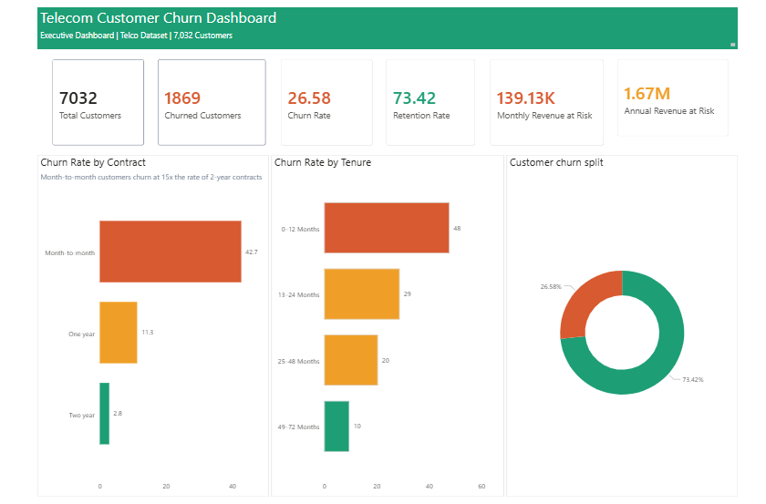
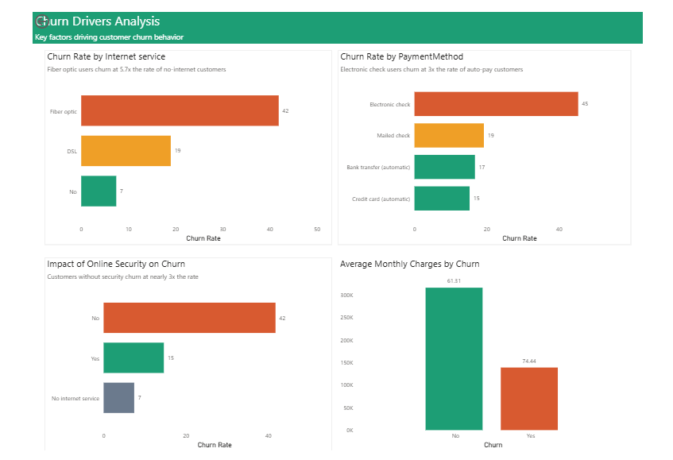
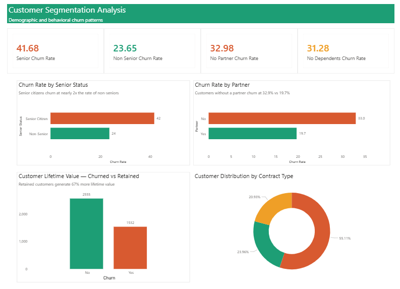
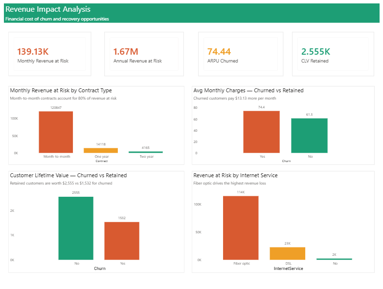
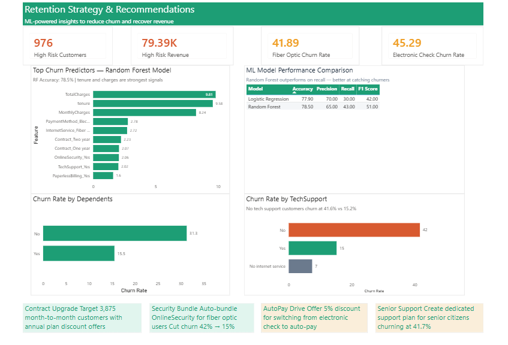

# 📊 Telecom Customer Churn Analytics Dashboard

## 🎯 Project Overview
End-to-end churn analytics solution analyzing 7,032 telecom 
customers to identify $1.67M revenue at risk.

## 🛠️ Tools Used
- Python — EDA, ML Models
- SQL — Data Analysis
- Power BI — Interactive Dashboard
- Scikit-learn — Logistic Regression, Random Forest

## 📈 Key Findings
- Churn rate: **26.58%**
- Annual revenue at risk: **$1.67M**
- Month-to-month churn: **42.7%**
- Electronic check churn: **45.3%**
- High risk customers: **976 at 67.7% churn**

## 🤖 ML Models
| Model | Accuracy | Recall |
|-------|----------|--------|
| Logistic Regression | 77.9% | 30% |
| Random Forest | 78.5% | 43% |

## 📊 Dashboard Preview

### Page 1 — Executive Overview

### Page 2 — Churn Drivers

### Page 3 — Customer Segments

### Page 4 — Revenue Impact

### Page 5 — Retention Strategy

## 🔗 Live Dashboard
[View on Power BI](https://app.powerbi.com/groups/me/reports/20a7ae10-5d7a-4801-b182-fde4b781621c/7b5cfe289a6729e3a4f3?experience=power-bi)

## 💡 Retention Recommendations
1. Contract upgrades for month-to-month customers
2. Security bundle for fiber optic users
3. AutoPay incentive for electronic check users
4. Senior citizen dedicated support tier
